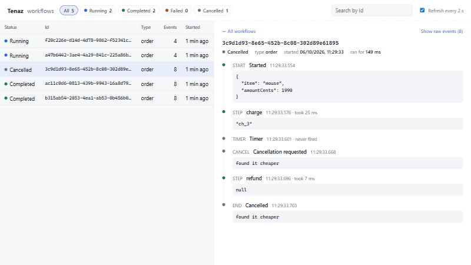

# Tenaz

A durable execution engine for Java 21. You write a business process as ordinary Java; Tenaz
guarantees it runs to completion even if every machine running it dies along the way.

```java
engine.register("order", Order.class, String.class, (ctx, order) -> {
    String payment = ctx.step("charge", String.class, step ->
            payments.charge(order, step.idempotencyKey()));

    DurablePromise<String> approval = ctx.signal("approve", String.class);
    DurablePromise<Void> deadline = ctx.timer(Duration.ofDays(3));   // holds no thread

    if (ctx.anyOf(approval, deadline) == deadline) {
        ctx.run("refund", step -> payments.refund(payment, step.idempotencyKey()));
        return "expired";
    }
    return ctx.step("ship", String.class, step -> warehouse.ship(order));
});
```

If the process is killed between `charge` and `ship`, another engine picks the order up and
continues from where it stopped. `charge` is not called again, and the three-day timer does not
restart.

## How it works

**The journal is the state.** Every workflow has an append-only history of events
(`StepScheduled`, `StepCompleted`, `TimerFired`, `SignalReceived`, ...). Nothing else is persisted:
no stack, no variables.

**State is rebuilt by replay, once.** When an engine picks a workflow up, it runs the code from
the top against the history: calls the history already answers return the recorded answer. At the
first call it cannot answer, the code's virtual thread parks with its stack intact. From then on
the engine feeds it new events and lets it run to the next unanswered call, so a step costs only
its own work, however long the history behind it. When the engine lets go of the workflow, or
dies, the stack is thrown away, and whoever picks the workflow up next rebuilds it by replay. See
[Replay.java](core/src/main/java/dev/tenaz/engine/Replay.java).

**Replay is deterministic by construction.** Workflow code can observe a pending result only by
waiting on it, and `anyOf` picks its winner by position in the history, never by wall-clock
arrival. A replay against a longer history therefore always retraces a replay against a shorter
one. Clocks, randomness and UUIDs go through the context and are recorded or derived. Code that
diverges from its own history is detected and rejected (`NonDeterminismError`).

**One owner at a time, enforced by fencing.** An engine drives a workflow under a lease. Each
claim bumps the workflow's epoch, and every write carries the epoch it was made under, so a worker
that lost its lease (crash, long GC pause, partition) cannot write: the journal rejects it.
Decisions additionally use optimistic concurrency on the history version, so a signal that lands
mid-replay forces a fresh replay instead of being ordered inconsistently.

**The engine never touches the world directly.** It is a set of short, non-blocking tasks that get
time, scheduling and step execution from an
[EngineRuntime](core/src/main/java/dev/tenaz/engine/EngineRuntime.java). In production that is virtual
threads and the wall clock; under test it is a single-threaded event loop driven by a seed.

## Children, cancellation and code changes

```java
engine.register("checkout", Cart.class, String.class, (ctx, cart) -> {
    // Children are ordinary workflows with their own history. The parent holds nothing while
    // it waits, and a child's outcome reaches it in the same atomic write that ends the child.
    DurablePromise<String> payment = ctx.childAsync("payment", ctx.workflowId() + "/pay", cart, String.class);
    DurablePromise<String> stock = ctx.childAsync("reserve-stock", ctx.workflowId() + "/stock", cart, String.class);
    try {
        payment.get();
        stock.get();
    } catch (WorkflowCancelledException e) {
        // handle.cancel(...) arrives as an exception, once, and is passed on to
        // the children still running. The code may keep using the context to clean up.
        ctx.run("notify-customer", step -> mail.cancelled(cart));
        throw e;
    }
    // Executions that passed this point before the fraud check existed get 0 and skip it;
    // new ones get 1, recorded in their history so that every replay agrees.
    if (ctx.version("add-fraud-check", 1) >= 1) {
        ctx.run("fraud-check", step -> fraud.check(cart));
    }
    return ctx.step("ship", String.class, step -> warehouse.ship(cart));
});
```

Cancellation is ordered like everything else, by position in the history. A result recorded
before the request is still returned; a wait for anything recorded after it, or an attempt to
start something new, throws. A replay therefore delivers the cancellation at exactly the point
where the live execution saw it.

## Guarantees

| | |
|---|---|
| Workflow progress | Runs to completion as long as one engine is alive |
| Journaled step | Never executed again |
| Step in flight during a crash | Executed again: **at-least-once**, with a stable idempotency key to make its effect exactly-once |
| Timers | Survive restarts; fire once |
| Starting a workflow | Idempotent on the workflow id |
| Child outcome | Reaches the parent exactly once, atomically with the end of the child |
| Starting a child | Only by the parent's current owner; a worker that lost the parent cannot |
| Cancelling a parent | Cancels the children it is still waiting for |

## Evidence

**Deterministic simulation.** [SimulationTest](core/src/test/java/dev/tenaz/sim/SimulationTest.java)
runs a three-node cluster inside one thread, with simulated time and every source of randomness
drawn from one seed. For thirty simulated seconds, clients start, signal and cancel workflows, some
of which run children, while nodes crash and restart, freeze for longer than their leases and wake
up as zombies, run on skewed clocks, lose notifications, and see journal operations fail both
before and after committing. Then the faults stop and the run must converge: every workflow ended,
every effect applied exactly once, every history well-formed, and no money created or lost by the
transfers that were cancelled halfway and had to refund.

- 500 seeds run on every build in a few seconds; 20,000 seeds (170 hours of simulated time,
  200,000 crashes, 650,000 journal failures, 65,000 cancelled workflows) run in two minutes and
  pass.
- A failing seed fails identically every time: `./mvnw test -Dtest=SimulationTest -Dtenaz.sim.seed=16`.
- The simulator is itself tested for the ability to fail. With fencing removed from the journal,
  it finds the resulting double write. Two deliberate bugs were also tried by hand: with `anyOf`
  preferring its first argument over history order it reported the broken workflow at seed 16,
  and with cancellation ignoring history order, at seed 0.

**Real processes.** The same test suites run against both journals.

- [ChaosTest](core/src/test/java/dev/tenaz/ChaosTest.java) runs 300 money transfers on a three-node
  cluster while killing a random node 60 times, and asserts that every transfer completes and every
  debit and credit takes effect exactly once. A typical run forces 30 to 70 steps to execute twice;
  the balances still match to the cent.
- [KillNineTest](core/src/test/java/dev/tenaz/KillNineTest.java) simulates nothing: the workers are
  separate JVMs on PostgreSQL, and the operating system destroys one every second or so, with no
  chance to clean up. Same assertions, same result.

```
./mvnw test
```

The repository has three modules: [core](core) is the engine and has no dependency on Spring,
[spring-boot-starter](spring-boot-starter) is the auto-configuration, and [example](example) is
the order service.

The PostgreSQL tests start a container and are skipped when Docker is not available.

## Using PostgreSQL

```java
PostgresJournal journal = new PostgresJournal(dataSource);   // a pooled DataSource
journal.migrate();                                            // creates the tenaz_* tables
TenazEngine engine = TenazEngine.builder(journal).build();
```

An append is a single statement. It bumps the workflow row's version only under the conditions the
caller is entitled to (the lease epoch, the expected version), and inserts the events and timers
only if that update matched: one round trip, atomic, with the row lock serializing writers of the
same workflow. A step therefore costs one commit, which carries its outcome together with whatever
the workflow decided to do next. Workers claim work in batches with `FOR UPDATE SKIP LOCKED` and
are woken by `LISTEN/NOTIFY`, with polling as a fallback. See
[PostgresJournal.java](core/src/main/java/dev/tenaz/journal/PostgresJournal.java).

## Spring Boot

Add `tenaz-spring-boot-starter` and annotate the workflow. It becomes a bean, with its
collaborators injected, and is registered with an engine the application can inject anywhere:

```java
@DurableWorkflow("order")
public class OrderWorkflow implements Workflow<Order, String> {

    private final PaymentGateway payments;

    public OrderWorkflow(PaymentGateway payments) {
        this.payments = payments;
    }

    @Override
    public String run(WorkflowContext ctx, Order order) {
        return ctx.step("charge", String.class,
                step -> payments.charge(order.amountCents(), step.idempotencyKey()));
    }
}
```

```java
@PostMapping("/orders")
OrderStatus place(@RequestBody Order order) {
    engine.start("order", UUID.randomUUID().toString(), order);
    ...
}
```

If the application has a PostgreSQL `DataSource`, histories go there and the tables are created
at startup; otherwise they are kept in memory. Payloads are encoded with the application's own
`ObjectMapper`. Every bean the starter defines steps aside for one of the application's.

| Property | Default | |
|---|---|---|
| `tenaz.journal` | `auto` | `auto`, `postgres` or `memory` |
| `tenaz.migrate` | `true` | create the `tenaz_*` tables if missing |
| `tenaz.workers-enabled` | `true` | `false` for an application that only starts and signals workflows |
| `tenaz.lease-ttl` | `10s` | how long a dead engine's workflows wait for a new owner |
| `tenaz.poll-interval` | `50ms` | how often to look for work no notification announced |
| `tenaz.max-concurrent-workflows` | `1000` | |
| `tenaz.worker-id` | random | this engine's name in leases |
| `tenaz.viewer.enabled` | `false` | serve the history viewer at `/tenaz` |

[example](example) is a small order service built this way: an order is charged, waits for
approval, and is shipped, or refunded if it is cancelled or nobody approves in time. To see an
order outlive the process that started it:

```
docker compose -f example/docker-compose.yml up -d
./mvnw -q install -DskipTests
java -jar example/target/tenaz-example-0.1.0-SNAPSHOT.jar --spring.profiles.active=postgres

curl -X POST localhost:8080/orders -H "Content-Type: application/json" -d '{"item":"keyboard","amountCents":4990}'
# stop the application, start it again, then:
curl -X POST "localhost:8080/orders/<id>/approval?by=ana"
curl localhost:8080/orders/<id>        # {"status":"COMPLETED","detail":"SHIPPED TRK1000, approved by ana"}
```

The order's history in the database shows the charge recorded once, before the restart, and the
shipment after it.

### History viewer

With `tenaz.viewer.enabled=true`, a web application serves a page at `/tenaz` that lists
workflows, filters them by status and id, and shows what happened in each: every step, timer,
signal and child on one line, with how long it took and what it returned, and a link from parent
to child and back. The example has it on.



The viewer only reads. It has no access control of its own, so put `/tenaz` behind the
application's security before enabling it anywhere that matters. The times it shows are when the
journal recorded each event, by the journal's clock; nothing the engine decides depends on them.

## Benchmarks

Steps do nothing, so these numbers are the engine's own overhead: what it costs to make a step
durable. Measured on a laptop (Core i7-11370H, 16 GB, Windows 11) with PostgreSQL 17 in Docker
Desktop at default settings, `fsync` on. For scale, on the same setup `pgbench -N` reaches about
750 transactions/s with one client and 9,800 with 32. Each figure is the range of two runs.

| Journal | Scenario | Result |
|---|---|---|
| PostgreSQL | 1 engine, 3,000 workflows of 5 steps | 520 to 550 workflows/s (2,600 to 2,800 steps/s) |
| PostgreSQL | 3 engines, 3,000 workflows of 5 steps | 580 to 620 workflows/s (2,900 to 3,100 steps/s) |
| PostgreSQL | idle engine, one 5-step workflow at a time | p50 33 ms, p99 37 to 41 ms |
| PostgreSQL | one workflow of 1,000 sequential steps | 1,050 to 1,085 steps/s |
| in-memory | 1 engine, 20,000 workflows of 5 steps | 21,000 to 21,500 workflows/s (105,000 steps/s) |
| in-memory | one workflow of 5,000 sequential steps | 40,000 to 43,500 steps/s |

Reading them:

- A 5-step workflow costs 8 commits (create, claim, first command, one per step), so 550
  workflows/s is about 4,400 commits/s, roughly half of what `pgbench` gets out of this database.
  Three engines add little over one: the engines are not the limit.
- Latency on an idle engine is those same 8 commits back to back.
- The in-memory figures show what the engine costs without a database: about 10 microseconds per
  step.
- A step in a long workflow costs the same as a step in a short one, because the code is not
  replayed between steps.

How it got here, each change measured back to back against the commit before it:

- Fetching only new events, appending in one statement instead of a five-statement transaction,
  journaling a step's outcome together with the next command, and claiming and renewing leases in
  batches took PostgreSQL throughput from 85-103 to 280-440 workflows/s and the 1,000-step
  workflow from 46-66 to 400-540 steps/s.
- Keeping the workflow's stack alive between steps took the 5,000-step workflow in memory from
  1,200-1,700 to 40,000 steps/s.
- A partial index keeps sleeping workflows out of the claim path: with 200,000 of them in the
  table, a claim reads only the 50 rows that need work.

This laptop is noisy: the same benchmark has varied by a factor of two between runs minutes
apart, so treat every figure as an order of magnitude.

```
./mvnw -q -pl core test-compile exec:java -Dexec.mainClass=dev.tenaz.bench.Benchmark -Dexec.classpathScope=test
```

## Limitations

- A workflow that is running holds a virtual thread, and its stack, on the engine that owns it.
  Workflows waiting only on timers or signals hold nothing.
- The benchmarks are from one laptop with the database in a local container. They say nothing
  about a real server or a network between engine and database.
- Retry attempts are counted per worker; a takeover restarts the count.
- Payload types are plain classes (`Class<T>`); generic types such as `List<Foo>` are not supported.
- Changing workflow code under executions in flight is safe only behind `ctx.version`; an
  unguarded change fails them with `NonDeterminismError`.
- Cancellation does not interrupt a step that is already running; the workflow code decides
  whether to wait for it.
- A child whose type no running engine has registered is never picked up, and its parent waits.
- Under PostgreSQL, a write that touches two workflows (a child ending, a parent cancelling
  children) can deadlock with a concurrent one in the opposite direction. PostgreSQL aborts one of
  them and the engine redoes it from the journal; it costs time, not correctness.
- `finally` blocks in workflow code also run whenever an engine lets go of the workflow, not only
  when the workflow ends.
- Signals are not deduplicated: a client that retries a signal after an ambiguous failure may
  deliver it twice.
- The simulation covers the engine on the in-memory journal. `PostgresJournal` is covered by the
  contract, chaos and kill -9 tests instead.
